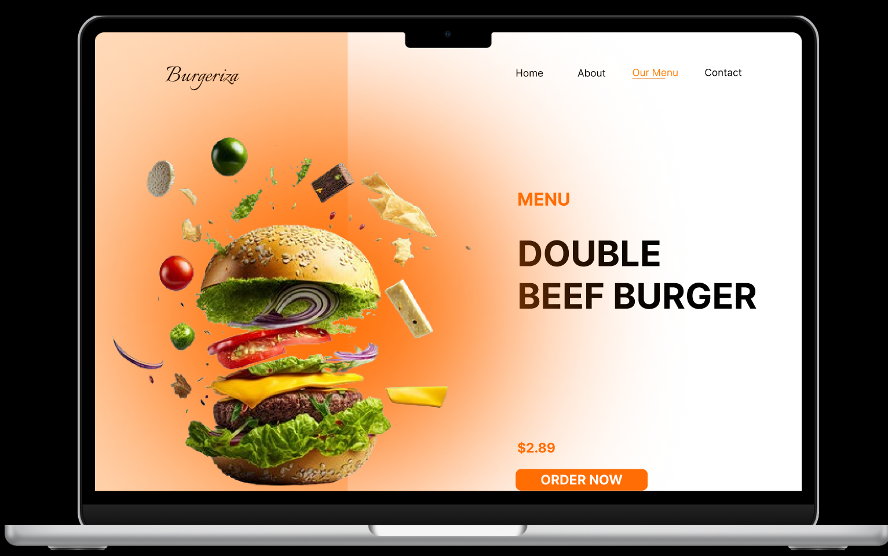

# Hi there 👋 I'm Meshwa Hirpara  

### 🚀 A passionate Machine Learning Engineer  

---

## 🙋‍♂️ About Me  

- 🎓 I am an Engineering Student  
- 🤖 Currently working on **AI / Machine Learning**  
- 📚 Currently learning **Data Structures & Algorithms (DSA)**  
- 🎯 Main Goal:  
  - Work on **real-time datasets**  
  - Integrate **Machine Learning models with APIs**  

---

## 🛠️ Tech Stack  

### 💻 Backend  
- Node.js  
- Express.js  

### 🗄️ Database  
- MongoDB  

### 📊 Machine Learning / Data Science  
- Scikit-learn  
- NumPy  
- Pandas  
- PyTorch  

---

## ⚙️ Tools & Technologies  

- Git & GitHub  
- VS Code  
- REST APIs  
- JSON  

---

## 🎯 Focus Areas  

- Machine Learning Model Development  
- Real-time Data Processing  
- API Integration with ML Models  
- Backend Development for AI Applications  

---

## 💡 Quote  
“Turning data into decisions.”

---
---

## 🧩 Tech Stack (Icons)

### 💻 Backend  

  
  

### 🗄️ Database  

  

### 📊 Machine Learning / Data Science  

  
  
  
  

### ⚙️ Tools  

  
  
  

-
## 🎨 UI/UX Designs

### 🍔 Burger App UI

  

### 🎮 Controller App UI

  

### ✨ UI Animation Demo

  

